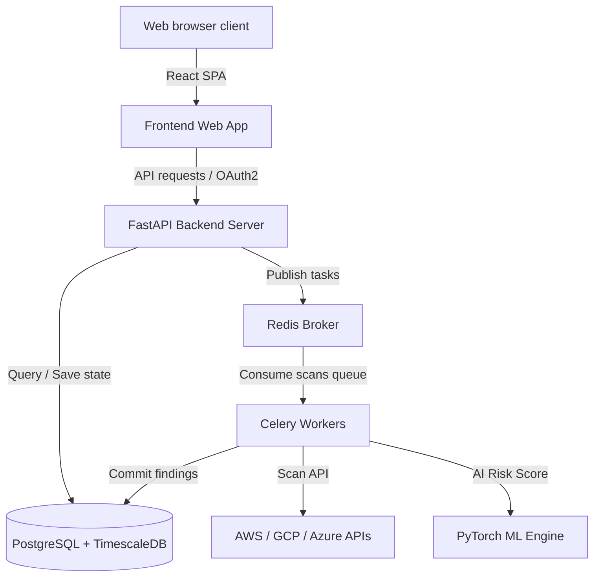

# SecureFlow - AI-Powered Cloud Security Posture Management (CSPM)

SecureFlow is an industrial-grade, production-ready Cloud Security Posture Management (CSPM) system. It features real-time cloud scanning, automated Terraform code remediations, and advanced Deep Learning models for threat scoring, log classifications, and network anomalies.

---

## 🏗️ System Architecture



---

## 📂 Project Structure

```
secureflow/
├── backend/
│   ├── app/
│   │   ├── api/             # Auth, Scans, Vulnerabilities routers
│   │   ├── config/          # Settings schema & DB pooling connections
│   │   ├── core/            # JWT security, custom middleware, exceptions
│   │   ├── database/        # Declarative models for SQL Tables
│   │   ├── ml/              # PyTorch Neural Classifiers & training scripts
│   │   ├── scanners/        # Boto3 AWS (S3, EC2, IAM) scanning loops
│   │   ├── services/        # Logic handlers
│   │   ├── tasks/           # Asynchronous Celery workers
│   │   └── utils/           # JSON logger, metrics hooks
│   └── tests/               # Pytest verification suite
├── frontend/
│   ├── src/
│   │   ├── components/      # Dashboard, ScanList, VulnerabilityDetails
│   │   ├── services/        # Axios API handlers
│   │   └── App.tsx          # Material UI application base
│   └── index.html           # SPA template mount
├── scripts/
│   ├── seed_database.py     # Database configuration seeder
│   └── setup.sh             # Automated bootstrapping tool
├── docker-compose.yml       # Production-ready orchestration
└── README.md
```

---

## ⚡ Quick Start (Single-Command Setup)

To configure, compile, train the AI models, and run the database and dashboard locally:

1. **Bootstrap local setup script**:
   ```bash
   bash scripts/setup.sh
   ```

2. **Start the orchestrations container**:
   ```bash
   docker-compose up --build
   ```

3. **Verify services**:
   - Access **SecureFlow Web App**: [http://localhost:3000](http://localhost:3000)
   - Access **FastAPI API Swagger Docs**: [http://localhost:8000/api/docs](http://localhost:8000/api/docs)
   - Default login email: `admin@secureflow.io`
   - Default login password: `password123`

---

## 🧠 AI/ML Engine Models

SecureFlow uses advanced Deep Learning models (developed in PyTorch and HuggingFace Transformers) to replace static threshold classifications:

- **Vulnerability Severity Predictor**: A PyTorch Neural Network with self-attention layers that aggregates category states to predict exact CVSS threat scores (Critical, High, Medium, Low).
- **Activity Anomaly Detector**: A PyTorch Autoencoder that measures reconstruction loss on cloud logs to isolate privilege escalations or exfiltration.
- **NLP Threat Classifier**: A BERT classification model fine-tuned on system logs to search for attacker inputs and shell injections.
