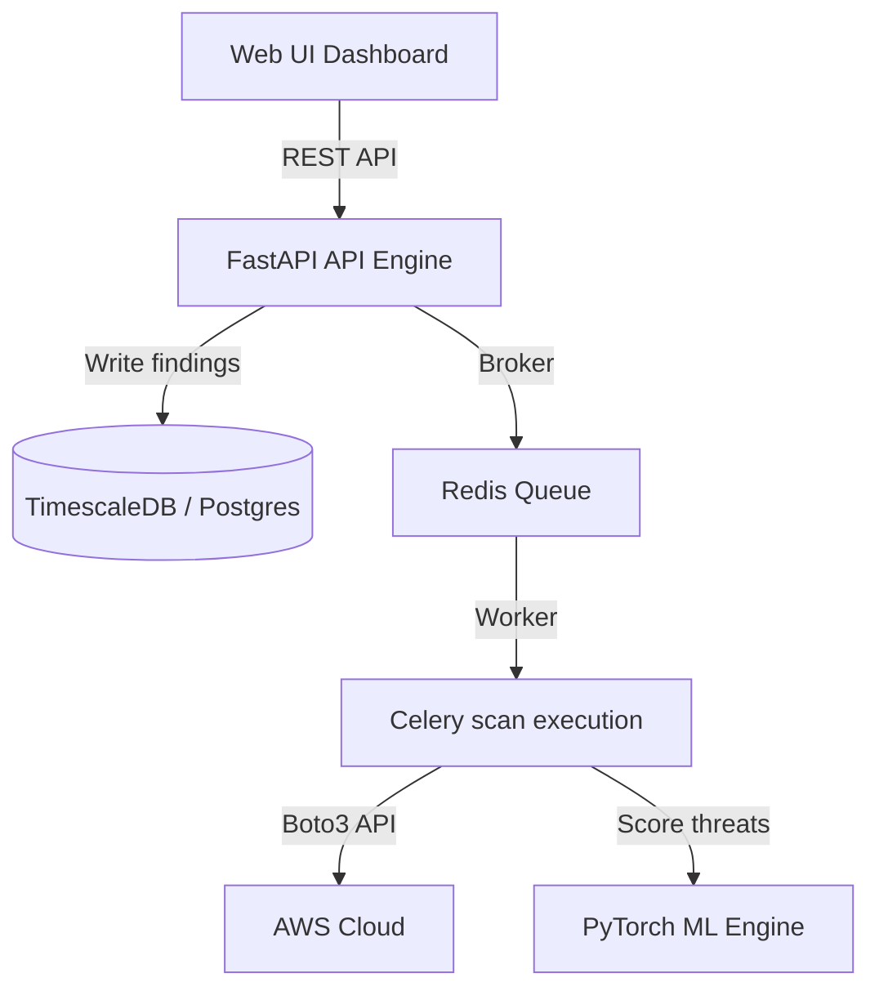

# SecureFlow Architecture Documentation

This document describes the design principles and data pipeline details of the **SecureFlow** platform.

---

## 🏗️ Design System

SecureFlow is built as a multi-tenant compliance auditor separating storage access and telemetry scans.

### 1. Database Multi-Tenancy
Multi-tenancy is enforced through the user's `organization_id` property. All tables (Scans, Vulnerabilities, AuditLogs) hold an `organization_id` index mapping and filters queries to prevent cross-tenant exposures.

### 2. Cloud Scanners Fallback Loop
When credential access parameters are empty, S3/EC2/IAM/RDS/VPC scanners enter a simulated execution mode. They create a consistent mock tree of typical cloud resources and apply standard security vulnerabilities. This enables full dashboard demos locally without active AWS keys.

### 3. PyTorch Severity Classifier Engine
The PyTorch `SeverityClassifier` model aggregates categorical labels (cloud provider, resource types, CVE definitions) and numerical scales (CVSS score, resource age, previous posture failures) to predict a severity level (Critical, High, Medium, Low). 

Self-attention layers weight features to calculate precise confidence metrics:
- A public S3 bucket is flagged as `CRITICAL` with high confidence.
- An inactive IAM key is marked as `MEDIUM` with lower overall risk exposure weights.
- Reconstruction error from the Autoencoder model isolates aberrant traffic vectors.
